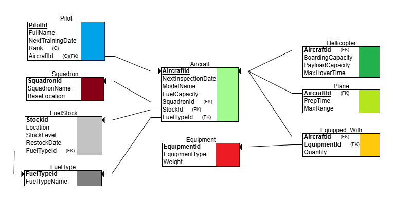
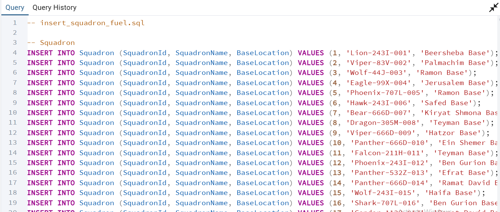
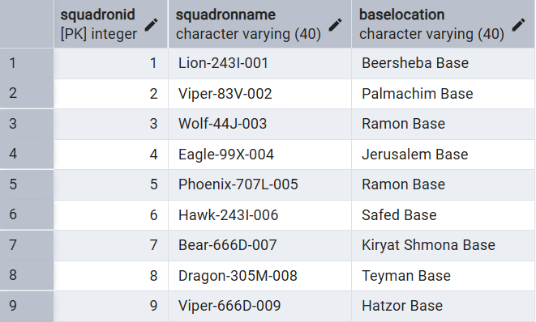
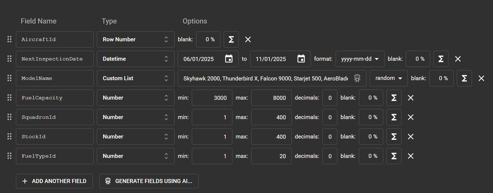
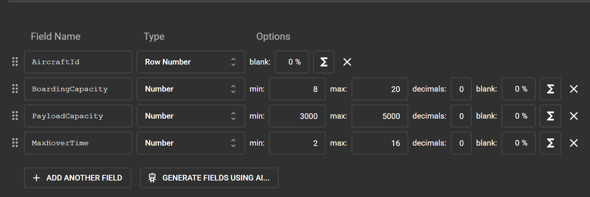
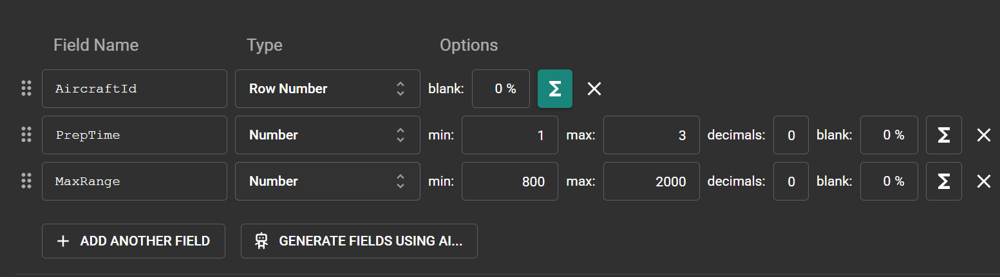
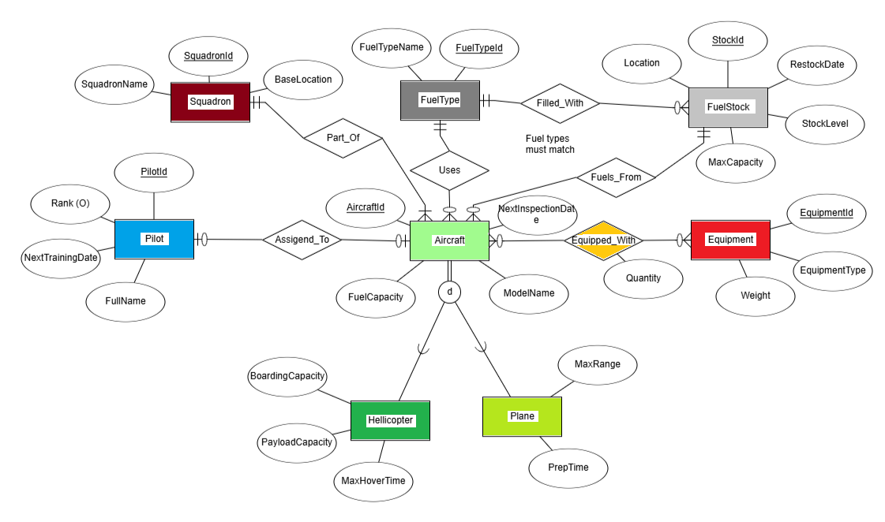

# Air Force Resources Database

**Submitted by:** Tzur Tamir 207876525 
**System:** Air Force Management  
**Unit:** Air Force Resources Management 

## Table of Contents
- [Introduction](#introduction)
- [ERD (Entity-Relationship Diagram)](#erd-entity-relationship-diagram)
- [DSD (Data Structure Diagram)](#dsd-data-structure-diagram)
- [SQL Scripts](#sql-scripts)
- [Data Insertion Methods](#data-insertion-methods)
- [Backup and Restore](#backup-and-restore)

## Introduction

The **Air Force Resources Database** is designed to manage critical information related to aircraft operations, including aircraft details, pilots, squadrons, equipment, and fuel stocks. This system is built using PostgreSQL running in a Docker container, providing a robust and scalable solution for organizing air force resources.

### Purpose and Functionality
This database stores and manages the following data:
- **Aircraft**: Details such as model names, inspection dates, and fuel capacities, with inherited subtypes:
    - **planes**: Additional plane-specific details.
    - **helicopters**: Additional hellicopter-specific details.
- **Pilots**: Information including names, training dates, ranks, and aircraft assignments.
- **Squadrons**: Organizational groups of aircraft with names and base locations.
- **Equipment**: Types and weights of equipment assigned to aircraft.
- **Fuel Stocks**: Fuel storage details like location, stock levels, and restock dates, linked to specific fuel types.

The primary functionalities include:
- Organizing aircraft into squadrons for operational management.
- Assigning pilots to aircraft for mission planning.
- Tracking equipment allocations to aircraft.
- Managing fuel stocks and ensuring compatibility with aircraft requirements.
- Storing and retrieving detailed records for administrative and operational use.

This system enhances efficiency, safety, and coordination within air force operations by providing a centralized data management solution.

### Design Decisions
- **Inheritance**: Aircraft is a supertype with Plane and Helicopter as subtypes to handle specific attributes (e.g., MaxRange for Planes, MaxHoverTime for Helicopters).
- **Relationships**: Used many-to-many (M:N) for Equipped_With to allow flexible equipment assignments, and one-to-many (1:N) for Fuels_From and Uses to reflect fuel stock and type dependencies.
- **Optional Links**: Assigned_To (Pilot-Aircraft) is optional on both sides to accommodate unassigned pilots or aircraft.

For detailed relationship explanations, see [Relationships](#relationships) below.

## ERD (Entity-Relationship Diagram)
  
*The ERD visualizes entities and their relationships as designed in the project.*

### Entities and Attributes

The following table explains the differnt entities and thier attributes in detail:

| Entity (Description) | Attribute |
|----------------------|-----------|
| **Equipment** (Unique identifier for equipment (Primary Key)) | EquipmentId |
| (Type of equipment (e.g., radar, weapon)) | EquipmentType |
| (Weight of equipment in kg) | Weight |
| **Aircraft** (Unique identifier for aircraft (Primary Key)) | AircraftId |
| (Model name of the aircraft (e.g., F-16)) | ModelName |
| (Date of the next maintenance inspection) | NextInspectionDate |
| (Fuel capacity in liters) | FuelCapacity |
| **Helicopter** (A type of Aircraft) (Unique identifier for helicopter, inherited from Aircraft) | AircraftId |
| (Number of people that can be boarded) | BoardingCapacity |
| (Payload capacity in kg) | PayloadCapacity |
| (Maximum hover time in hours) | MaxHoverTime |
| **Plane** (A type of Aircraft) (Unique identifier for plane, inherited from Aircraft) | AircraftId |
| (Preparation time for flight in hours) | PrepTime |
| (Maximum flight range in km) | MaxRange |
| **Pilot** (Unique identifier for pilot (Primary Key)) | PilotId |
| (Full name of the pilot) | FullName |
| (Date of the next training) | NextTrainingDate |
| (Military rank) | Rank |
| **Squadron** (Unique identifier for aircraft squadron (Primary Key)) | SquadronId |
| (Name of the squadron) | SquadronName |
| (Base location) | BaseLocation |
| **FuelStock** (Unique identifier for fuel stock (Primary Key)) | StockId |
| (Location of the stock) | Location |
| (Stock content in liters (currently filled)) | StockLevel |
| (Restock date) | RestockDate |
| **FuelType** (Unique identifier for fuel type (Primary Key)) | FuelTypeId |
| (Name of the fuel type (e.g., JP-8)) | FuelTypeName |
| **Equipped_With (Relationship)** (Aircraft identifier (part of composite key)) | AircraftId |
| (Equipment identifier (part of composite key)) | EquipmentId |
| (Quantity of equipment assigned to aircraft) | Quantity |


### Relationships
The following table explains the different relationships in the ERD:

| Relationship Name | Description |
|-------------------|-------------|
| **Part_Of**       | A Squadron consists of many Aircraft (1:N). An Aircraft must belong to a Squadron, and a Squadron must consist of Aircrafts. |
| **Assigned_To**   | An Aircraft is assigned to one Pilot (1:1), optional on both sides as an Aircraft may lack a Pilot and vice versa. |
| **Equipped_With** | An Aircraft can have multiple Equipment types, and an Equipment type can serve multiple Aircraft (M:N), optional since not all Aircraft require special equipment. |
| **Fuels_From**    | An Aircraft refuels from one FuelStock, and one FuelStock can serve multiple Aircraft (1:N). Each Aircraft must have a FuelStock, but a FuelStock may not yet serve any Aircrafts. |
| **Uses**          | An Aircraft requires one FuelType (1:N), mandatory for Aircraft to have a type, optional for a FuelType to be used by any Aircrafts. |
| **Filled_With**   | A FuelStock contains one FuelType, and one FuelType can fill multiple FuelStocks (1:N). A FuelStock must have a FuelType, but a FuelType may not have associated FuelStocks. |

## DSD (Data Structure Diagram)
  
*The DSD outlines the relational schema derived from the ERD.*

## SQL Scripts
The following SQL scripts are provided in the repository:
- **Create Tables**: Defines all tables and triggers.  
  📜 **[View `createTables.sql`](Phase1/Scripts/createTables.sql)**  
- **Insert Data**: Adds initial sample data.  
  📜 **[View `insertTables.sql`](Phase1/Scripts/insertTables.sql)**  
- **Drop Tables**: Removes all tables in the correct order.  
  📜 **[View `dropTables.sql`](Phase1/Scripts/dropTables.sql)**  
- **Select All Tables**: Retrieves all data from each table.  
  📜 **[View `selectTables.sql`](Phase1/Scripts/selectTables.sql)**  

## Data Insertion Methods
Data was added to the database using three distinct methods:

### 1. Python Script (Squadron, FuelStock)
- **Tool**: Custom Python script to generate SQL insert statements.
- **Details**: 
  - **Squadron**: 400 rows with unique `SquadronId`, names (e.g., "Hawk-504B-001"), and base locations from a list of 22 options.
  - **FuelStock**: 400 rows with `StockId`, locations (e.g., "Warehouse A-1"), stock levels (a fraction between 0 and 1 to represent fullness ), and `FuelTypeId` linked to the existing 20 fuel types.
- **Files**:  
  📜 **[View `generate_sql.py`](Phase1/Programming/generate_sql.py)**
  📜 **[View `insert_squadron_fuel.sql`](Phase1/Programming/insert_squadron_fuel.sql)**  

- **Screenshots**:  
  

  *running insert_squadron_fuel.sql in pgAdmin query tool.*
  
  

  *data successfuly added.*

### 2. Mockaroo (Aircraft, Helicopter, Plane, Equipment)
- **Tool**: [Mockaroo](https://www.mockaroo.com/) for generating realistic mock data.
- **Details**: 
  - **Aircraft**: 800 rows (`AircraftId` 1-800) with model names, inspection dates, and fuel capacities.
  - **Helicopter**: Subset of Aircraft with boarding and payload capacities, and hover times. 400 rows (`AircraftId` 1-400).
  - **Plane**: Subset of Aircraft with prep times and max ranges. 400 rows (`AircraftId` 401-800).
  - **Equipment**: 400 rows (`EquipmentId` 1-400) with types (e.g., "Radar-001") and weights (100-1000 kg).
- **Files**:
  📜 **[View `AIRCRAFT_MOCK_DATA.csv`](Phase1/FilesMockaroo/AIRCRAFT_MOCK_DATA_data.csv)**  
  📜 **[View `HELICOPTER_MOCK_DATA.csv`](Phase1/FilesMockaroo/HELICOPTER_MOCK_DATA_data.csv)**  
  📜 **[View `PLANE_MOCK_DATA.csv`](Phase1/FilesMockaroo/PLANE_MOCK_DATA_data.csv)**  
  📜 **[View `EQUIPMENT_MOCK_DATA.csv`](Phase1/FilesMockaroo/EQUIPMENT_MOCK_DATA_data.csv)**  
- **Screenshots**:  
  

  *mockaroo aircraft configs.*
  
  

  *helicopter aircraft configs.*
  
  

  *mockaroo aircraft configs. applied the formula 'this+400' to aircraftId to match id scope of 401-800.*
  
  

  *mockaroo equipment configs. equipment name is generated from a combination of its general type {eq1} and its serial number{eq2}, consisting of three digits and a letter (e.g 107Z). the formula 'toUpper(this)' was applied on {eq2} for the letter in the serial number to be converted to its uppercase equivelant.*
  
  

  *uploading the generated csv mock data for aircraft.*
  
  

  *result of row count for aircraft after upload.*


### 3. CSV Files (Equipped_With, Pilot)
- **Tool**: Pre-generated CSV files imported via the pgAdmin 'import data' option.
- **Details**: 
  - **Equipped_With**: 500 rows linking `AircraftId` (1-800) to `EquipmentId` (1-400) with quantities (1-4).
  - **Pilot**: 500 rows (`PilotId` 1-500) with names (e.g., "James Smith"), next training dates, ranks, and optional `AircraftId` (50% linked to 1-800).
- **Files**:  
  📜 **[View `Pilot_data.csv`](Phase1/DataImportFiles/Pilot_data.csv)**  
  📜 **[View `EquippedWith_data.csv`](Phase1/DataImportFiles/EquippedWith_data.csv)**  
- **Screenshots**:
  *Showing CSV import process for EquippedWith in pgAdmin:*

   
  
  
  
  

  *result of row count for EquippedWith after upload.*


  **Note:** Since FuelType is no more than a lookup table meant to inhance storage efficiency by storing the finite set of fuel names for the use of other tables, we decided it makes more sense to provide all of its data as part of the [`insertTables.sql`](Phase1/Scripts/insertTables.sql) mentioned above. That is also the reason that we decided it should have 20 rows and not 400. (It does not make since to treat this table like others, for it is the same as a "status" table, providing a finite, mostly predefined set of options).

## Backup and Restore
- **Backup**: Data is backed up using pgAdmin's backup database option.
  - Files are stored with date and time stamps.  
  📁 **[View Backup Folder](Phase1/Backup)**

 
 
 *Showing backup result file.*
 
- **Restore**:
 Running the backup file on an empty dataset:
  


 
  *Showing restore execution and verification.*


## Edit: FuelStock Enhancements

### Reasons for the changes
To enhance the realism of the `FuelStock` table, the schema was updated to include `MaxCapacity`, and `StockLevel` was converted from a percentage to liters. These changes were applied to the existing 400 rows while preserving data integrity.

**updated ERD:**


### Changes Made
- **Addition of MaxCapacity**:
  - A new column, `MaxCapacity`, was added to define the maximum storage capacity of each fuel stock in liters.
  - The default `MaxCapacity` was set to 2,500,000 liters to reflect a realistic scale for air force fuel stocks.
    ```sql
    ALTER TABLE FuelStock ADD COLUMN MaxCapacity INT NOT NULL DEFAULT 2500000;
  - For existing rows, `MaxCapacity` was set as the greater of 1,500,000 liters or 3,500,000 * `StockLevel` (where `StockLevel` was the original percentage scaled appropriately).
    ```sql
    UPDATE FuelStock SET MaxCapacity = GREATEST(3500000 * StockLevel, 1500000);
    
- **Conversion of StockLevel**:
  - Originally, `StockLevel` represented the fill percentage (0-1). It was converted to liters by calculating the lesser of 2,500,000 * `StockLevel` (scaled) or the `MaxCapacity`.
  - This makes `StockLevel` a concrete volume in liters, aligned with `MaxCapacity`.
    ```sql
    UPDATE FuelStock SET StockLevel = LEAST(2500000 * StockLevel, MaxCapacity);
- **Creating Realistic Distribution**:
  - After conversion, most stocks were around 70% full. To introduce variety in fill levels, the following query was executed:
    ```sql
    UPDATE FuelStock
    SET StockLevel = LEAST(StockLevel * (RANDOM() * (1.44 - 0.8) + 0.8), MaxCapacity);

- an updated version of the files createTables.sql, insertTables.sql was added to the [scripts](Phase1/scripts) directory to ensure compatability with the updated schema.
    ---
